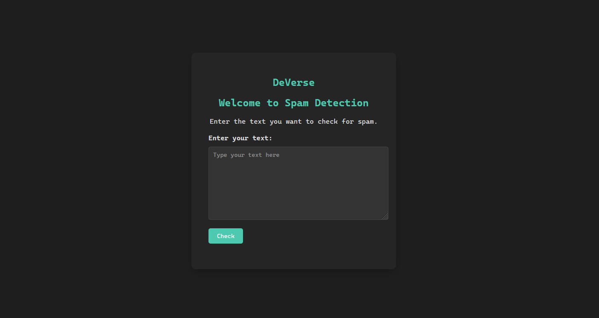

# Spam Detection Web App with Node.js and Express

This is a simple web application for spam detection using Node.js, Express, and the `natural` library. It reads data from a CSV file containing text messages and allows users to submit messages for spam detection through a web interface.

## Features

- Spam detection using the `natural` library.
- CSV file reading to load messages for analysis.
- User-friendly web interface for submitting messages.

## Requirements

Before running the application, make sure you have the following installed:

- [Node.js](https://nodejs.org/)
- [npm](https://www.npmjs.com/)

